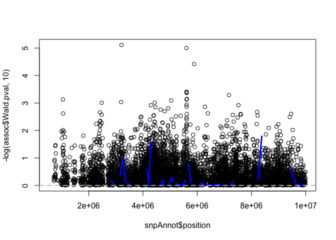

What is admixture mapping?
--------------------------

\begin{itemize}
\item Admixture mapping is a type of association analysis that can be performed only in admixed populations. 
\item In the history of mankind, sub-populations were formed, that have distinct genomic features. 
\begin{itemize}
\item Different frequencies of genetic variants, or population-specific genetic variants. 
\end{itemize}
\item Hispanics/Latinos are admixed. 
\begin{itemize}
\item A Hispanic/Latino individual likely have ancestors from three ancestral populations: European, African, Amerindian. 
\end{itemize}
\item Since chromosomes are inherited from parents in a process of recombination, for each person, segments of the chromosome were inherited from a specific ancestry (and ancestor). 
\end{itemize}
What is admixture mapping?
--------------------------

\begin{figure}
\includegraphics{recombination.png}
\end{figure}
What is admixture mapping?
--------------------------

\begin{itemize}
\item There are softwares that can delineate intervals along the chromosomes in a data set, and for each person, ``say" which ancestry this interval was inherited from. 
\begin{itemize}
\item Software name: RFMix
\item It uses a ``reference panel": genetic sequences from people in relevant ancestral populations. 
\item Underlying local ancestry intervals (LAIs) are likely not exactly the same for all people, but they are defined the same way by the software. 
\end{itemize}
\item Local ancestry inference was performed in the HCHS/SOL by Browning et al. (2016, G3), and the results are available. 
\end{itemize}
Looking at local ancestry files
-------------------------------

\begin{itemize}
\item Let's look at a file with local ancestry information. 
\begin{itemize}
\item This is from the simulated data.
\end{itemize}
\end{itemize}
``` r
library("GWASTools")
dir <- paste0("/home/postdoc/tsofer/SISG/", 
    "Preparing_simulated_data_2")
scanAnnot <- getobj(file.path(dir,
                    "SISG_phenotypes.RData"))
admixAnnot <- getobj(file.path(dir, 
                    "SISG_local_ancestry_snpAnnot.RData"))
```

Looking at local ancestry files
-------------------------------

``` r
dim(admixAnnot)
```

    ##      snps variables 
    ##        75         6

``` r
head(pData(admixAnnot))
```

    ##   snpID pos.start pos.end position chromosome nmarkers
    ## 1     1    558390 1177226   867808          1       35
    ## 2     2   1177227 1805338  1491282          1       19
    ## 3     3   1805339 2108309  1956824          1       25
    ## 4     4   2108310 2272806  2190558          1       14
    ## 5     5   2272807 2412100  2342454          1       69
    ## 6     6   2412101 2737608  2574854          1       11

Looking at local ancestry files
-------------------------------

\begin{itemize}
\item We need to use different functions (from before) to read the data
\item Because now we have genotype dosages/count per ancestry!
\end{itemize}
``` r
require(gdsfmt)
gds <- openfn.gds(file.path(dir, 
                  "SISG_local_ancestry_2.gds"))
gds
```

    ## File: /home/postdoc/tsofer/SISG/Preparing_simulated_data_2/SISG_local_ancestry_2.gds (22.7K)
    ## +    [  ]
    ## |--+ CEU_dosage   { Bit2 75x500, 9.2K }
    ## |--+ MEX_dosage   { Bit2 75x500, 9.2K }
    ## |--+ sample.id   { Str8 500, 2.3K }
    ## |--+ snp.id   { Int32 75, 300B }
    ## |--+ snp.chromosome   { Float64 75, 600B }
    ## \--+ snp.position   { Int32 75, 300B }

Looking at local ancestry files
-------------------------------

``` r
ancestries <- c("CEU", "MEX")
genoDataList <- vector(mode = "list", length = 2)
names(genoDataList) <- ancestries 
for (ancestry in ancestries){
  gds.reader <- GdsGenotypeReader(gds, 
            genotypeVar=paste0(ancestry, "_dosage"))
  
  genoDataList[[ancestry]] <- GenotypeData(gds.reader, 
                                 scanAnnot=scanAnnot)
}
```

Looking at local ancestry files
-------------------------------

-   Now we have a list with genotype readers.
-   We can apply functions presented before on each of the list components.

``` r
genoDataList[["CEU"]] 
```

    ## An object of class GenotypeData 
    ##  | data:
    ## File: /home/postdoc/tsofer/SISG/Preparing_simulated_data_2/SISG_local_ancestry_2.gds (22.7K)
    ## +    [  ]
    ## |--+ CEU_dosage   { Bit2 75x500, 9.2K }
    ## |--+ MEX_dosage   { Bit2 75x500, 9.2K }
    ## |--+ sample.id   { Str8 500, 2.3K }
    ## |--+ snp.id   { Int32 75, 300B }
    ## |--+ snp.chromosome   { Float64 75, 600B }
    ## \--+ snp.position   { Int32 75, 300B }
    ##  | SNP Annotation:
    ## NULL
    ##  | Scan Annotation:
    ## An object of class 'ScanAnnotationDataFrame'
    ##   scans: 1 2 ... 500 (500 total)
    ##   varLabels: scanID EV1 ... group (8 total)
    ##   varMetadata: labelDescription

Looking at local ancestry files
-------------------------------

-   Now we have a list with genotype readers. We can apply the same function as before on each of the list components.

``` r
getGenotype(genoDataList$CEU)[1:4,1:4]
```

    ##      [,1] [,2] [,3] [,4]
    ## [1,]    2    2    1    1
    ## [2,]    1    2    2    1
    ## [3,]    2    2    2    1
    ## [4,]    1    0    2    1

``` r
getScanID(genoDataList$MEX)[1:4]
```

    ## [1] "p1" "p2" "p3" "p4"

``` r
## Use one list slot to close the connection to file-

close(genoDataList[[1]])
```

Admixture mapping - how does it work?
-------------------------------------

-   The local ancestry "genotypes" are not actually counts of genotypes.
-   They are counts of ancestry!
-   So if person have count of 2 for its CEU dosage in interval 3, it means that
    -   Interval 3 in the 's two chromosomes 1 was inherited from a CEU ancestor.
-   In admixture mapping, we test the local ancestry counts.

Admixture mapping - how does it work?
-------------------------------------

-   In admixture mapping, we test the local ancestry counts.
-   Why is it meaningful? intuition:
    -   Because if a genotype is more frequent in one population (pop1);
    -   And it is also associated with a trait;
    -   People with more of the intervals spanning the genotypes inherited from pop1, are more likely to have the trait.
-   Mathematically, it can be shown that
    -   If there are two ancestral populations;
    -   There is a single causal variant in an interval;
    -   The genotype effect size *β* is the same in the two populations;
    -   The allele frequency in the two ancestral populations are *f*<sub>1</sub> and *f*<sub>2</sub>;
    -   Then the effect size estimated by testing the LAI counts is *β*(*f*<sub>1</sub> − *f*<sub>2</sub>).

Admixture mapping - how does it work?
-------------------------------------

-   The effect size estimated by testing the LAI counts is *β*(*f*<sub>1</sub> − *f*<sub>2</sub>).
    -   This is lower than the effect size of the genotype *β*.
    -   If *f*<sub>1</sub> = =*f*<sub>2</sub>, this "effect" equals zero, and so admixture mapping is not useful.
    -   If *f*<sub>1</sub> = 0 or *f*<sub>2</sub> = 0, it'll equal *f*<sub>2</sub>*β* or *f*<sub>1</sub>*β*.
    -   Regular association mapping may actually give something smaller.

Admixture mapping power
-----------------------

-   Suppose we had a specific variant *g* genotyped on all peopled.
-   And we had the local ancestry counts in the interval spanning *g*.
-   Then, testing the genotype association will be more powerful than testing the local ancestry.

However...

-   Sometimes we don't have *g* genotyped, but we do have ancestry counts for an interval spanning *g*.
-   There are many less local ancestry intervals than genotypes
    -   Reducing the *p*-value required for significance of LAI associations.
-   The causal *g* may be rare, making genotype associations unstable, even if the genotype is in the data.
    -   While LAI associations do not suffer from this instability.

Admixture mapping is useful in these cases.

Admixture mapping power
-----------------------

-   Consider the case where we do have the causal genotype.
-   Its effect *β* = 0.06, and the
-   Significance of association results: 5 × 10<sup>−8</sup>, of admixture mapping results: 5.7 × 10<sup>−5</sup>.
-   See figure for difference in power comparing association to admixture mapping as a function of ancestry-specific frequencies.

Admixture mapping power
-----------------------

\begin{figure}
\includegraphics{{20170621_admixmap_power_effect_0.06_a1freq_0.5}.pdf}
\end{figure}
Admixture mapping power
-----------------------

-   Causal genotype effect *β* = 0.06, and the
-   Significance of association results: 5 × 10<sup>−8</sup>, of admixture mapping results: 5.7 × 10<sup>−6</sup>
-   Comparing the previous figure to the next, shows less advantage for admixture mapping in this case.

Admixture mapping power
-----------------------

\begin{figure}
\includegraphics{{20170621_admixmap_power_effect_0.06_a1freq_0.2}.pdf}
\end{figure}
Admixture mapping power
-----------------------

Additional settings in which admixture mapping is useful:

-   The effect sizes is different between ancestries (even if the allele frequencies are the same across ancestries!).
-   Multiple causal variants in the LAI.

Take-home message: admixture mapping can sometimes detect association regions that association mapping cannot.

Admixture mapping - let'd do it!
--------------------------------

-   First, let's open again the connection to file
-   And create genotypeReaders.

``` r
gds <- openfn.gds(file.path(dir, 
                  "SISG_local_ancestry_2.gds"))
ancestries <- c("CEU", "MEX")
genoDataList <- vector(mode = "list", length = 2)
names(genoDataList) <- ancestries 
for (ancestry in ancestries){
  gds.reader <- GdsGenotypeReader(gds, 
            genotypeVar=paste0(ancestry, "_dosage"))
  
  genoDataList[[ancestry]] <- GenotypeData(gds.reader, 
                                 scanAnnot=scanAnnot)
}
```

Admixture mapping - let'd do it!
--------------------------------

-   Prepare for analysis...

``` r
covariates <- c("EV1", "EV2", "sex", "age", "group")
outcome <- "trait"
HH.mat <- getobj(file.path(dir, 
                  "SISG_houshold_matrix.RData"))
kin.mat <- getobj(file.path(dir, 
                  "SISG_relatedness_matrix.RData"))
covMatList <- list(HH = HH.mat, kinship = kin.mat)
```

Admixture mapping - let'd do it!
--------------------------------

-   Fit the null mixed model as before,
-   and test using the GENESIS function admixMapMM.(MM: mixed model)

``` r
library(GENESIS)
nullmod <- fitNullMM(scanData = scanAnnot,
              outcome = outcome, 
              covars = covariates, 
              covMatList = covMatList, 
              verbose = FALSE)
# run admixture mapping
assoc.admix <- admixMapMM(genoDataList, 
                          nullMMobj = nullmod)
```

    ## Running analysis with 500 Samples and 75 SNPs

    ## Beginning Calculations...

    ## Block 1 of 1 Completed - 0.05388 secs

Admixture mapping - let'd do it!
--------------------------------

``` r
close(genoDataList[[1]])
head(assoc.admix)
```

    ##   snpID chr   n CEU.freq CEU.Est   CEU.SE MEX.freq MEX.Est   MEX.SE
    ## 1     1   1 500    0.691      NA       NA    0.309      NA       NA
    ## 2     2   1 500    0.686   3.500 54862950    0.314   4.500 54862950
    ## 3     3   1 500    0.677      NA       NA    0.323      NA       NA
    ## 4     4   1 500    0.707      NA       NA    0.293      NA       NA
    ## 5     5   1 500    0.703   1.625 47546887    0.297   1.375 47546887
    ## 6     6   1 500    0.721      NA       NA    0.279      NA       NA
    ##   Joint.Stat Joint.pval
    ## 1         NA         NA
    ## 2 0.93551254  0.6264062
    ## 3         NA         NA
    ## 4         NA         NA
    ## 5 0.05489418  0.9729262
    ## 6         NA         NA

Admixture mapping - let'd do it!
--------------------------------

-   Let's also perform the usual association testing.

``` r
gds <- GdsGenotypeReader(file.path(dir, 
                           "SISG_snp_dosages.gds"))
snpAnnot <- getobj(file.path(dir, 
                    "SISG_snp_dosages_snpAnnot.RData"))
genoData <- GenotypeData(gds, 
              snpAnnot=snpAnnot, scanAnnot = scanAnnot)
assoc <- assocTestMM(genoData  , nullMMobj = nullmod)
```

    ## Running analysis with 500 Samples and 7463 SNPs

    ## Beginning Calculations...

    ## Block 1 of 2 Completed - 1.863 secs

    ## Block 2 of 2 Completed - 0.5814 secs

Admixture mapping - let'd do it!
--------------------------------

``` r
plot(snpAnnot$position, -log(assoc$Wald.pval, 10))
lines(admixAnnot$position, 
        -log(assoc.admix$Joint.pval, 10), 
        col = "blue", lwd = 3)
abline(h = 5.7e-5, col = "grey", lty = 2, lwd = 2)
```

 \#\# Admixture mapping - let's do it!

``` r
close(gds)
```

Example from our work: admixture mapping of mean arterial pressure (MAP)
------------------------------------------------------------------------

-   We performed admixture mapping of blood pressure traits (under review).
-   Analysis of MAP. Here is the Manhattan plot from the MAP analysis, testing counts of LAI from Amerindian ancestry (baseline is either European or African).

\begin{figure}
\includegraphics[trim = 0 0 0 3.4cm , clip]{map_amr.png}
\end{figure}
Example from our work: admixture mapping of mean arterial pressure (MAP)
------------------------------------------------------------------------

-   Here's a figure with the significant admixture mapping region on chromosome 6.
-   With the usual association analysis results (from GWAS that tested SNP allele dosages).
-   Question: why do we use symbols when testing SNPs, lines when testing LAIs?

\begin{figure}
\includegraphics[height = 5cm, width = 5cm]{map_amr_with_assoc.png}
\end{figure}
Example from our work: admixture mapping of mean arterial pressure (MAP)
------------------------------------------------------------------------

-   Our end goal is to find genetic variants driving the association.
-   How can we find them?

Recall: admixture mapping associations are detected when there is a Also, when there is a

Example from our work: admixture mapping of mean arterial pressure (MAP)
------------------------------------------------------------------------

Candidate variants explaining the admixture mapping are likely:
\begin{itemize}
\item Somewhat significant in usual association testing.
\item  Have different frequencies between ancestry.
    \begin{itemize}
    \item Or different effect sizes. 
    \end{itemize}
\end{itemize}
But we don't have ancestry-specific frequencies, nor effect sizes!

\begin{itemize}
\item Proxy: different genetic analysis groups have different ancestry proportions. 
\item difference in ancestry-specific frequencies, likely lead to differences in allele frequencies between genetic analysis groups!
\end{itemize}
Example from our work: admixture mapping of mean arterial pressure (MAP)
------------------------------------------------------------------------

-   We identified a set of SNP candidate that were
    -   Somewhat significant in association testing
    -   Had difference in allele frequencies between the Mexican (high Amerindian ancestry proportion) and Cuban (low) genetic analysis group.
-   And LD pruned them, to get four SNPs.

\begin{figure}
\includegraphics{map_snps.png}
\end{figure}
Example from our work: admixture mapping of mean arterial pressure (MAP)
------------------------------------------------------------------------

-   Next: check whether these SNPs drive the admixture mapping association.
-   Perform conditional analysis - the same linear mixed model, with these SNPs as covariates.

\begin{figure}
\includegraphics[height = 6cm, width = 6cm]{map_amr_cond.png}
\end{figure}
Example from our work: admixture mapping of mean arterial pressure (MAP)
------------------------------------------------------------------------

-   Finally, we can also use the package ASAFE to calculate ancestry-specific allele frequencies of the four SNPs.

\begin{figure}
\includegraphics[trim = 0 0 0 2cm, clip, width = 4cm, height = 5cm]{map_amr_asafe.png}
\end{figure}
Exercises
---------

\begin{enumerate}
\item Which is the LAI with the most significant p-value in the admixture mapping? 
\begin{itemize}
    \item How many genotyped/imputed variants are in this LAI?
    \item What is the most significant SNP in this LAI?
    \item Can you use the formula $\beta(f_1 - f_2)$ to guestimate an effect size for the potential causal SNP in the LAI? if yes, what is it? if not, why not?
    \end{itemize}
\item Find the genotype with the largest MAF difference between the UW and UNC groups.
\item Use this genotype in simulating a new trait with the code in the next slide, and run a new admixture mapping analysis. 
\end{enumerate}
Code for simulations
--------------------

-   First we find a SNP with large MAF differences between the UNC and UW groups.

``` r
gds.geno <- GdsGenotypeReader(file.path(dir, 
                           "SISG_snp_dosages.gds"))
genoData <- GenotypeData(gds.geno, 
              snpAnnot=snpAnnot, scanAnnot = scanAnnot)
Afreqs.unc <- alleleFrequency(genoData, scan.exclude = 
                  scanAnnot$scanID[
                      which(scanAnnot$group == "uw")], 
                  verbose = FALSE)
Afreqs.uw <- alleleFrequency(genoData, scan.exclude = 
                  scanAnnot$scanID[
                      which(scanAnnot$group == "unc")],
                  verbose = FALSE)
```

Code for simulations
--------------------

-   Extract the genotypes

``` r
select.genotype.ind <- which.max(
      abs(Afreqs.unc[,"MAF"] - Afreqs.uw[,"MAF"]))
Afreqs.uw[select.genotype.ind, "MAF"]
```

    ## [1] 0.33

``` r
Afreqs.unc[select.genotype.ind, "MAF"]
```

    ## [1] 0.2233333

``` r
genotype.id <- getSnpID(gds.geno)[select.genotype.ind] 
causal.genotype <- getGenotypeSelection(gds.geno, 
                                  snpID = genotype.id)
close(gds.geno)
```

Code for simulations
--------------------

-   Use the genotype in simulations

``` r
require(mvtnorm)
n <- nrow(kin.mat)
new.trait <- 
  nullmod$model.matrix %*% matrix(c(4, 5, -2, 1, 4,2)) + 
    causal.genotype*2 + 
    matrix(rmvnorm(n = 1, mean = rep(0, n), 
            sigma = diag(rep(120, n)) + 
                      80*kin.mat + 40*HH.mat))
scanAnnot$new.trait <- as.numeric(new.trait)
```

-   Now run admixture mapping with the outcome "new.trait"!
-   Run also association analysis, and create a figure with the results on top of each other.
